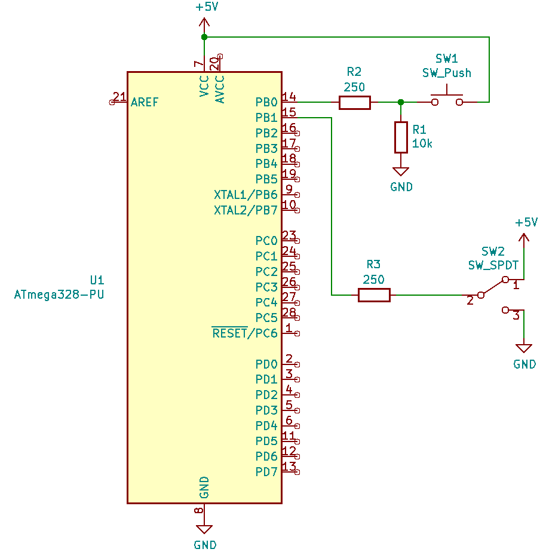
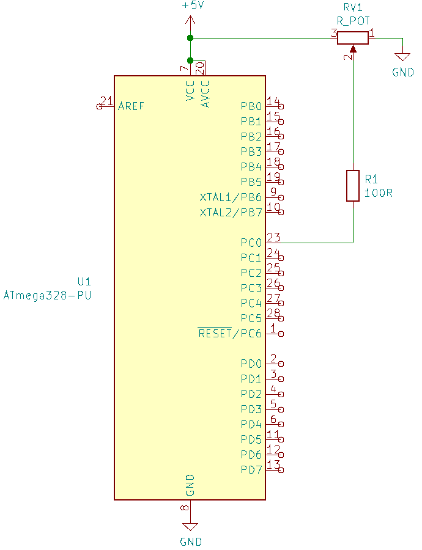
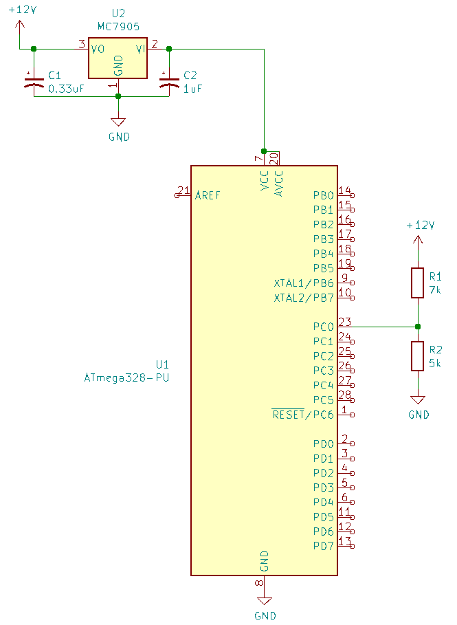

# 2.2 Basic schematics

[CPU datasheet](http://ww1.microchip.com/downloads/en/DeviceDoc/Atmel-7810-Automotive-Microcontrollers-ATmega328P_Datasheet.pdf)

## 1

[LED datasheet](https://cz.mouser.com/datasheet/2/143/everlight_ds300028-1165996.pdf) 

VCC = 5V  
Vf = 3.8V  
If = 20mA  
R1 = (5V - 3.8V) / 20mA = 1.2V / 0.02A = 60&Omega;

## 2

R2/3 = 5V / 20mA = 25m&Omega;

### 3

## 4

[Voltage regulator datasheet](https://cz.mouser.com/datasheet/2/308/MC7900_D-1773699.pdf)

Value of R1 is calculated the same way as in 2.2.1
R2 = 5V / 20mA = 250&Omega;

## 5

[Potentiometer datasheet](https://www.ttelectronics.com/TTElectronics/media/ProductFiles/Potentiometers/Datasheets/P164.pdf)

The range of the potentiometer is 1k&Omega; to 1M&Omega; so there should be no need for resistor.

## 6

[Thermistor datasheet](https://cz.mouser.com/datasheet/2/240/Littelfuse_Leaded_Thermistors_Glass_Coated_Chip_Th-1840008.pdf)

Used GT102B1K with resistance 1k&Omega;.

## 7

[Voltage regulator datasheet](https://cz.mouser.com/datasheet/2/308/MC7900_D-1773699.pdf)

I12V = 12V / 1200&Omega; = 10mA

## 8

[RGB LED datasheet](http://fec.4art-studio.com/uploads/dataSheet/1524922212_colour%20rgb%20smd%20led%20board%20module.pdf)

VCC = 5V
If = 20mA  
**Red LED:**  
Vf = 2V  
R1 = (5V - 2V) / 20mA = 3V / 0.02A = 150&Omega;  
**Green LED:**  
Vf = 3V  
R1 = (5V - 3V) / 20mA = 2V / 0.02A = 100&Omega;  
**Blue LED:**  
Vf = 3V  
R1 = (5V - 3V) / 20mA = 2V / 0.02A = 100&Omega;  
  

