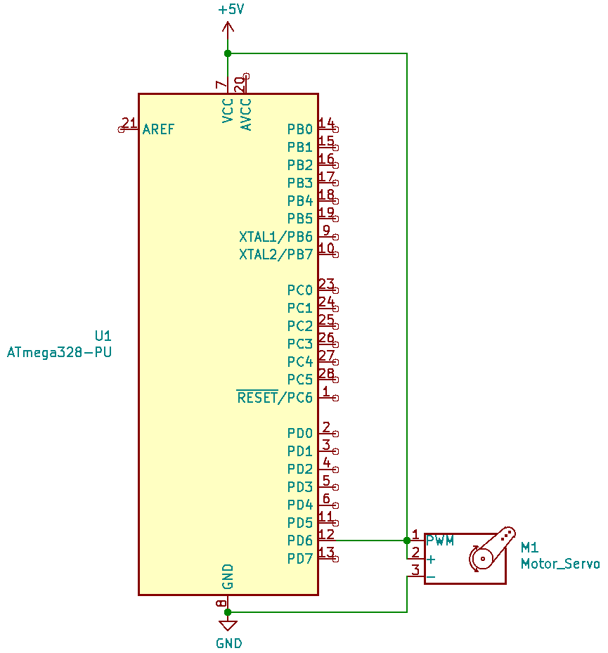
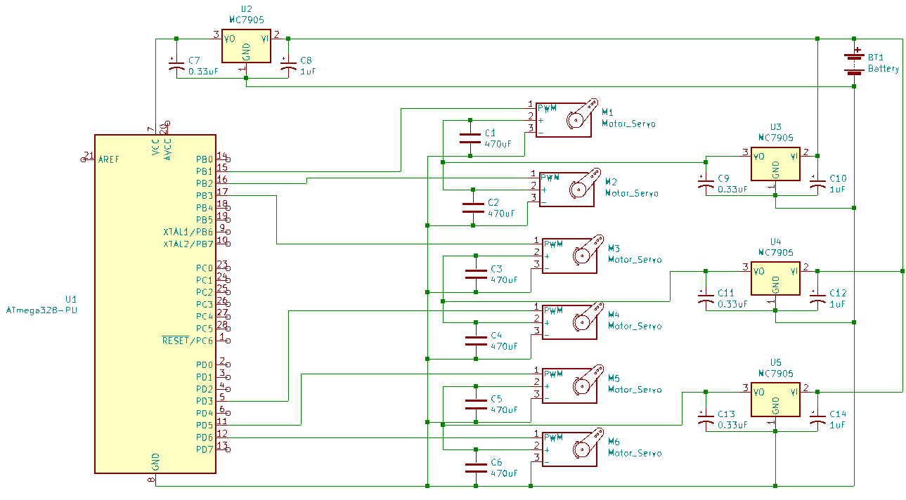
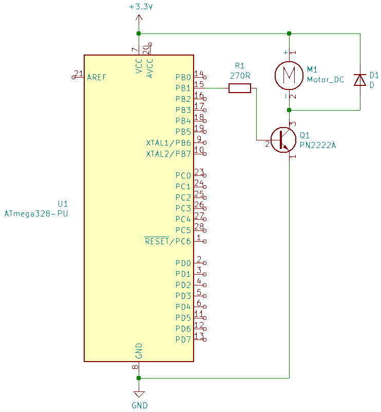
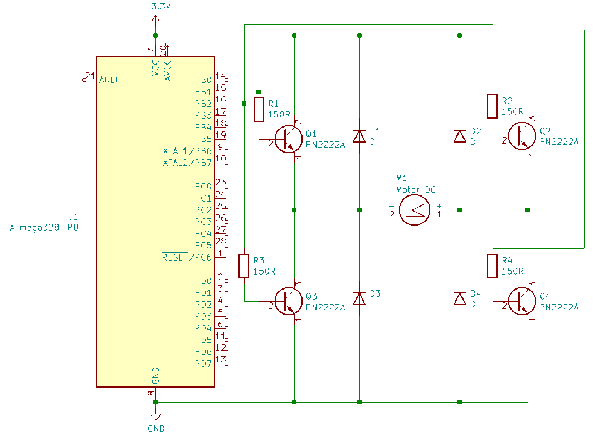

# 2.3 Schematics with high power consumption

## 9 Servo

[Servo datasheet](http://www.ee.ic.ac.uk/pcheung/teaching/DE1_EE/stores/sg90_datasheet.pdf)

## 10 Multiple servos

## 11 DC Motor

## 12 DC Motor - both directions

## 13 Motor and Speed controller

`todo`

