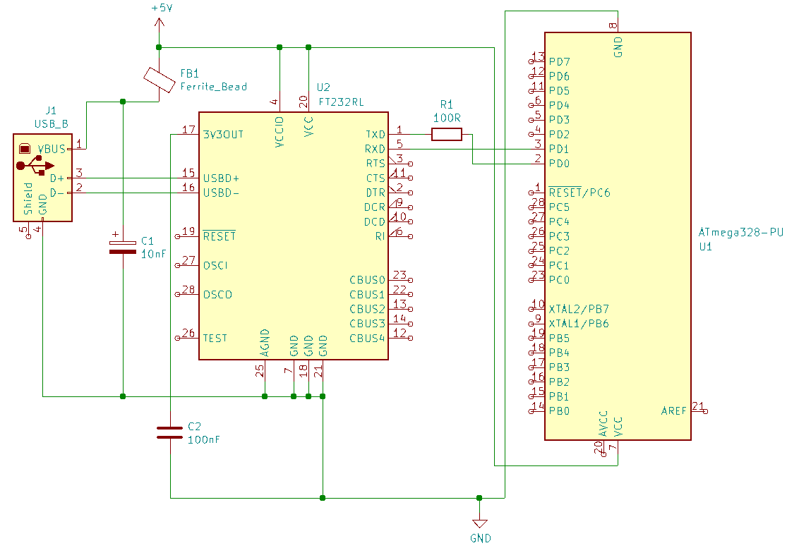
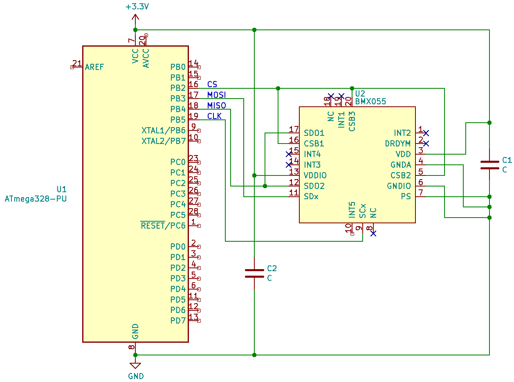
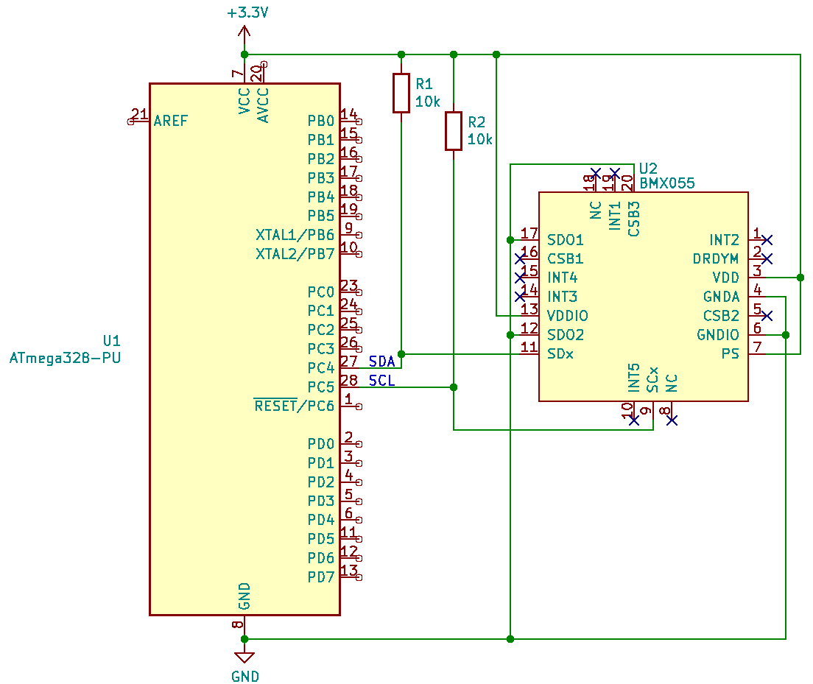
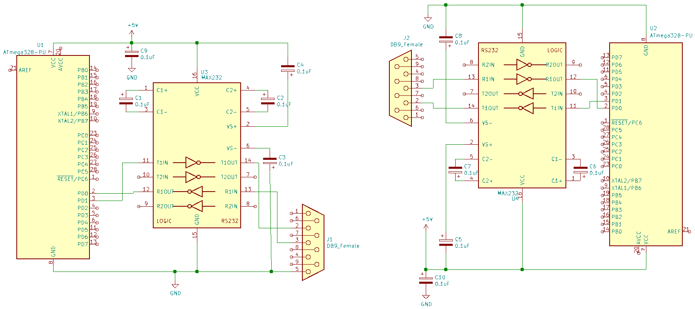
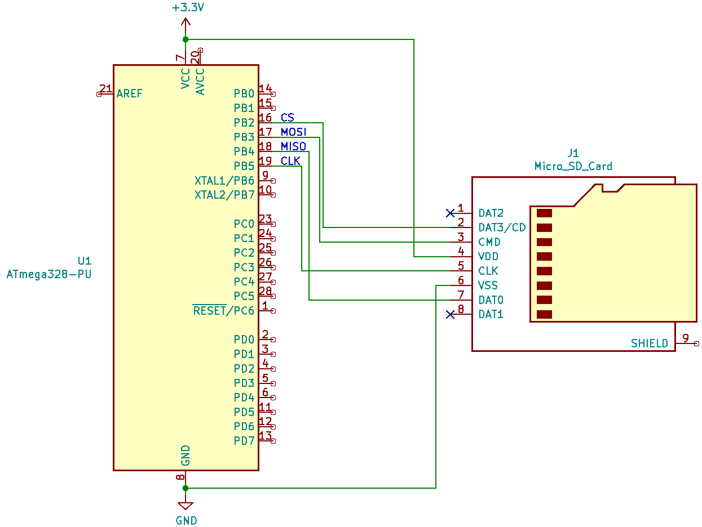

# Schematics of the peripherals

## 14 FTDI chip via UART

## 15 Absolute oriantation sensor via SPI

## 16 Absolute oriantation sensor via I2C

## 17 Two cpus via UART

## 18 CPU and SD card

[max232 datasheet](https://eu.mouser.com/datasheet/2/256/MAX202E-MAX241E-1292516.pdf)

